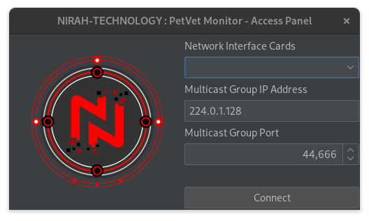
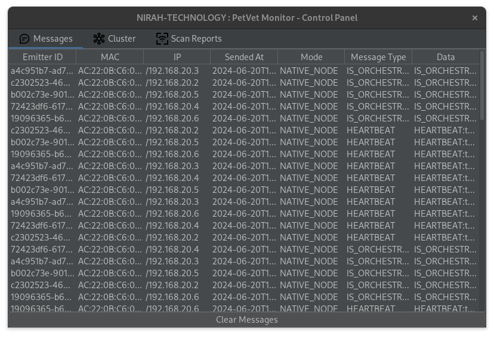
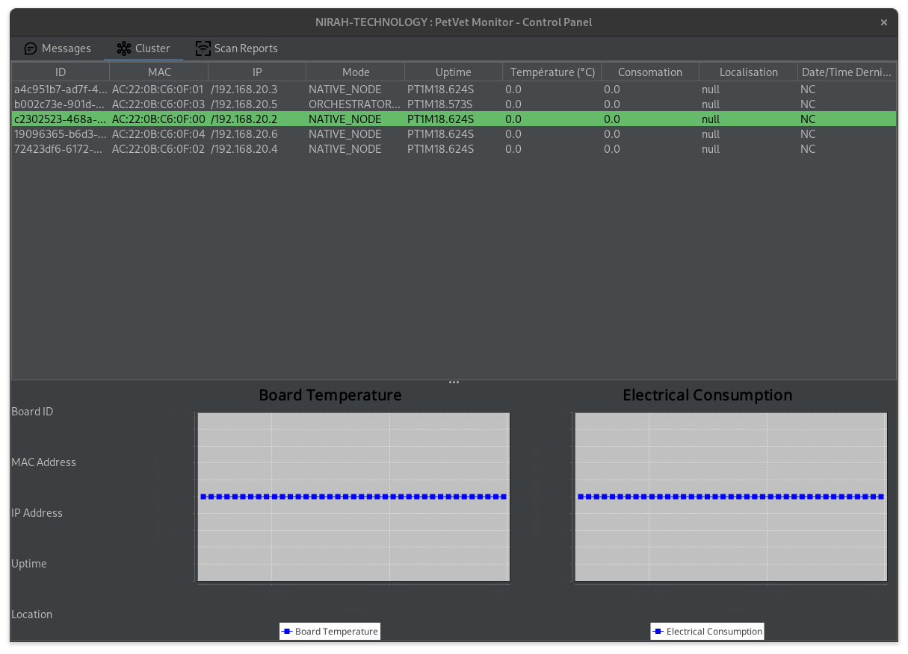

# **PETVET Cluster Monitor**
# *Supervision de Cluster de Cartes Électroniques*

## **Description du Projet**

Ce projet Java est une application graphique permettant de superviser un cluster de cartes électroniques (type Arduino, Raspberry Pi, etc.) capables de communiquer via un réseau multicast. L'application offre les fonctionnalités suivantes :

- Affichage des messages envoyés en multicast.
- Détection dynamique des microcontrôleurs actifs sur le réseau.
- Détection automatique des microcontrôleurs devenus silencieux (ne communiquant plus sur le réseau).
- Affichage de l'état de santé détaillé d'un microcontrôleur :
    - Identifiant, adresse MAC et IP.
    - Temps de fonctionnement (uptime).
    - Température et consommation électrique.
    - Localisation physique.
    - Date du dernier message envoyé.
- Affichage des rapports de scan réseau émis par chaque microcontrôleur.


## **Fonctionnalités**

- **Affichage des Messages Multicast** : Permet de visualiser tous les messages envoyés via le réseau multicast.

- **Détection Dynamique des Microcontrôleurs** : Identifie automatiquement et liste les microcontrôleurs actifs sur le réseau.

- **Détection des Microcontrôleurs Muets** : Notifie lorsque des microcontrôleurs cessent d'émettre des messages sur le réseau.

- **État de Santé des Microcontrôleurs** : Présente de manière détaillée les informations essentielles sur chaque microcontrôleur connecté.

- **Rapports de Scans Réseau** : Affiche tous les rapports de scans réseau générés par les microcontrôleurs.

## **Captures d'Écran**






## **Configuration**

Voici un exemple de fichier de configuration pour le simulateur :

```properties
# Configuration des nodes
cluster.size=1

# Configuration du réseau
network.ip.filter=192.168.0.0
network.multicast.group=224.0.1.128
network.multicast.port=44666
```


## **Installation et Utilisation**

Pour utiliser cette application, suivez ces étapes :

1. Installer Java (>= JRE 17).
2. Téléchargez le fichier JAR de l'application depuis [lien de téléchargement].
3. Lancez l'application en exécutant la commande suivante :

```bash
java -jar petvet-cluster-monitor-1.0-SNAPSHOT.jar
```
4.  Suivez les instructions à l'écran pour commencer la supervision de votre cluster de microcontrôleurs.

## **Développement**

Pour développer ou contribuer au projet, suivez ces étapes :

1. Clonez le dépôt Git :

```bash
git clone https://github.com/nirah-technology/petvet.git
```

2. Importez le projet dans votre IDE Java préféré.
3. Explorez le code source et les tests pour comprendre le fonctionnement de l'application.
4. Apportez vos modifications et testez-les localement.
5. Soumettez une pull request avec une description détaillée des changements apportés.

## **Technologies Utilisées**

- Java
- Swing (pour l'interface graphique)
- Multicast Networking
- JFreeChart (pour la représentation graphique des données)

## **Contributions**

Les contributions au projet sont les bienvenues ! N'hésitez pas à ouvrir une issue pour signaler un bug ou à soumettre une pull request pour ajouter de nouvelles fonctionnalités.


## **Licence**

Ce projet est sous licence [CC BY-NC 4.0](./LICENSE).